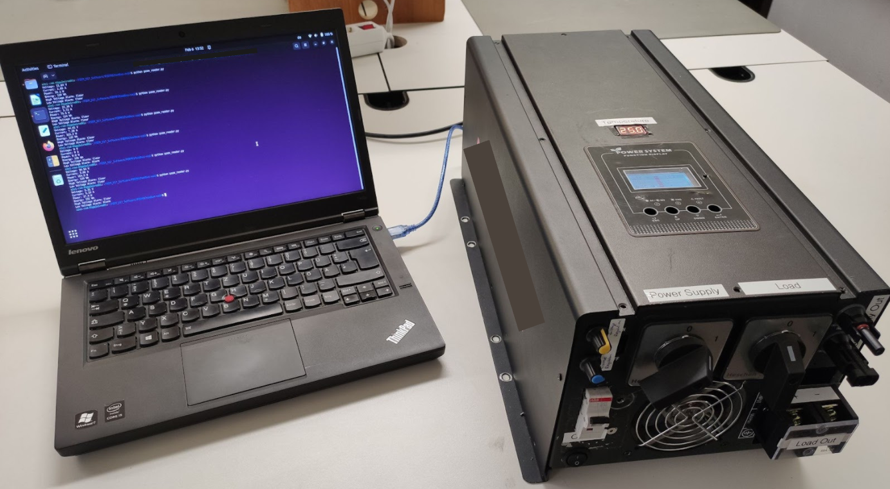
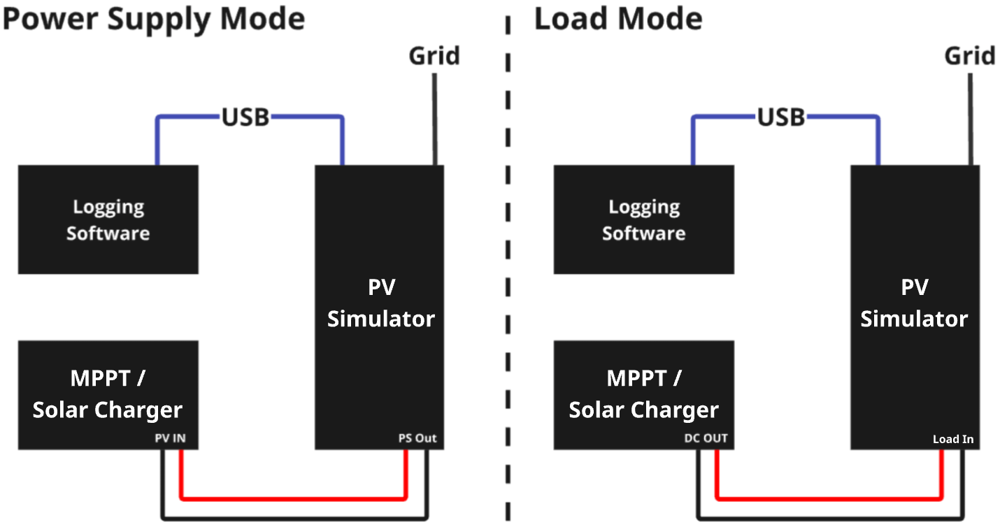
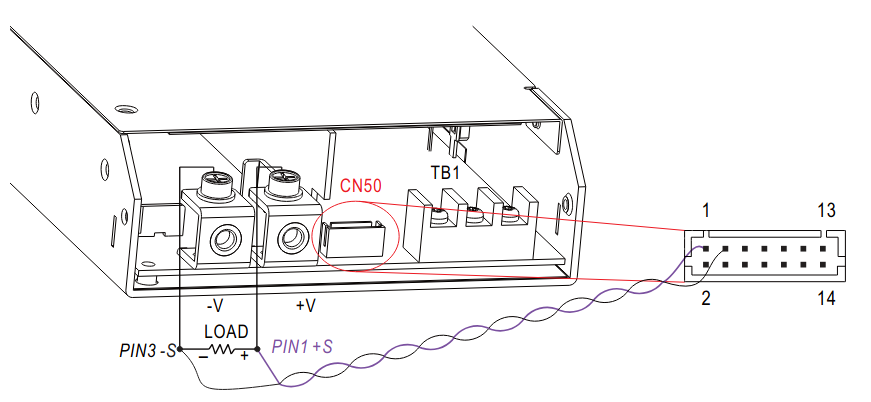
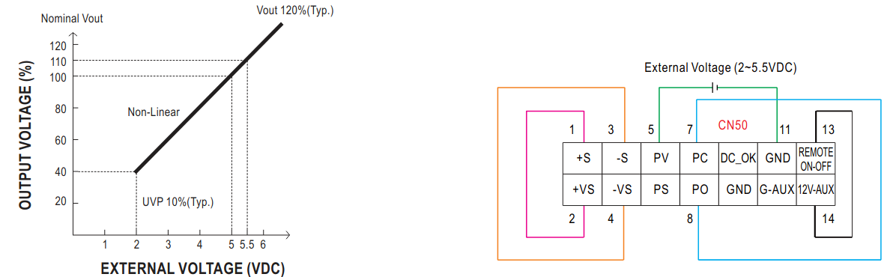
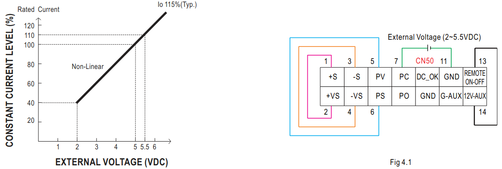
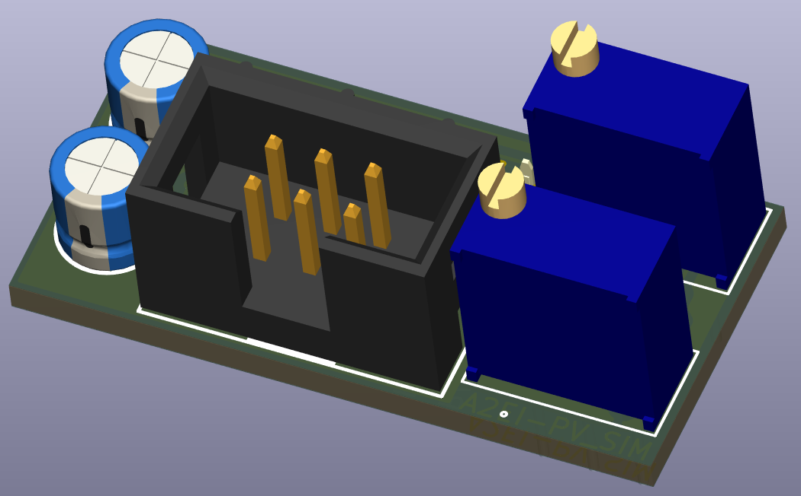
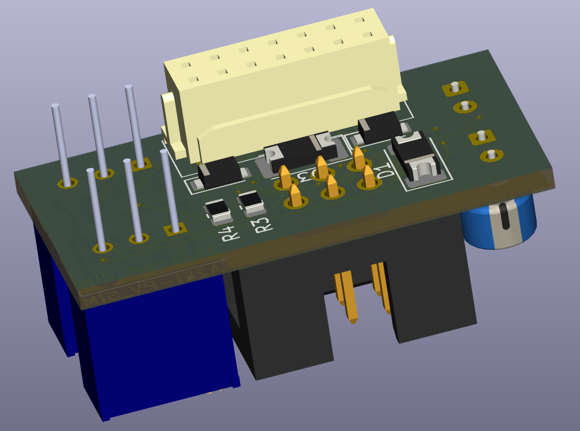
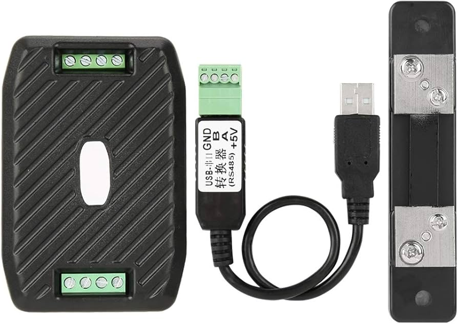

# PV_Simulator

This is an adjustable power supply and load with USB logging feature. The power supply is based on 2 MeanWell RSP-750-48 modules and can be operated with an output voltage between 20V and 96V DC.

## Setup

## Hardware

The schematics can be found here: [01_EDA_General](./01_Hardware/01_EDA_General)

To control the voltage and current output of the MeanWell RSP-750-48 modules a PCB was designed to adjust the voltage and current level. This can be done via the pins PV and PC of the CN50 connector.

With this PCB the voltage and current can be controlled with a simple potentiometer where each potentiometer is connected to one of the rows of the 2x3 connector.

## Code

The PV Simulator has a USB logging function via the PZEM017 energy meter. The code was developed on the base of [github.com/croutonso/PZEM017modbus](https://github.com/croutonso/PZEM017modbus).

